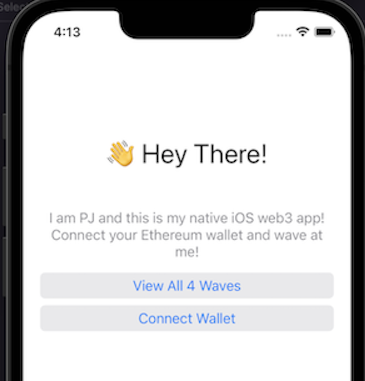

# WavePortal
Native iOS implementation of the WavePortal tutorial

The intro course on [Buildspace](https://buildspace.so/) showed you how to build a smart contract, and deploy to the Rinkeby test network. Further, we created a React frontend that interacted with the deployed smart contract.

I wanted to know if I could make an iOS native frontend.

## To Do

- [x] Figure out how to read from smart contract (call getAllWaves function)
- [ ] Connect a wallet
- [ ] Write to the smart contract (call wave function)